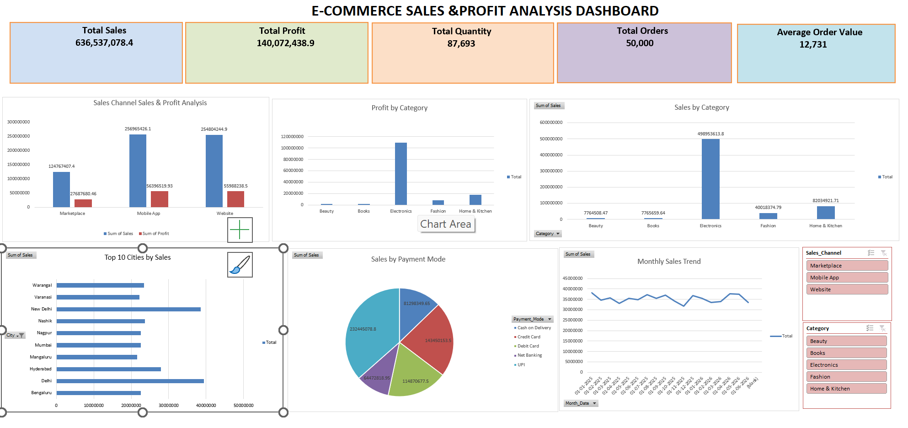

# E-Commerce Sales & Profit Analysis Dashboard

## 📊 Project Overview
An interactive E-Commerce Sales & Profit Analysis Dashboard created using Microsoft Excel.

## 🛠️ Tools & Skills
- Microsoft Excel
- Pivot Tables
- Pivot Charts
- Slicers
- Data Analysis
- Dashboard Design

## 📈 Key KPIs
- Total Sales
- Total Profit
- Total Quantity
- Total Orders
- Average Order Value

## 📌 Dashboard

## 🔍 Analysis
The dashboard provides insights into sales and profit across:
- Sales Channels
- Product Categories
- Cities
- Payment Methods
- Monthly Sales Trends
